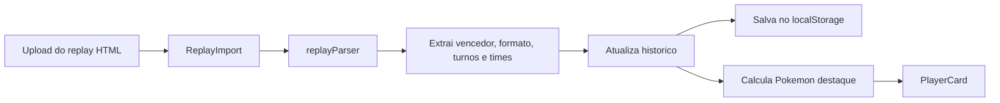
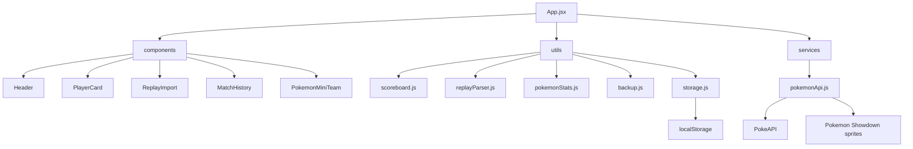

# Placar Pokemon Showdown

Aplicacao web local feita com React + Vite para controlar o placar das partidas diarias de Pokemon Showdown entre Jean Carlos e Felipe Eckert.

## Objetivo

O objetivo do projeto e oferecer um placar visual, responsivo e persistente para registrar vitorias em Single Battles e Double Battles, acompanhar estatisticas, importar replays HTML do Pokemon Showdown e manter um historico detalhado com os times usados em cada partida.

## Motivacao

Este projeto foi criado para acompanhar de forma divertida e visual o placar diario de partidas de Pokemon Showdown entre Jean Carlos e Felipe Eckert, separando vitorias em Single Battles e Double Battles.

## Demonstracao Visual


> Placeholder reservado para um print futuro da tela principal da aplicacao.

Um GIF ou video curto da aplicacao podera ser adicionado futuramente. Veja as instrucoes em [docs/demo-placeholder.md](docs/demo-placeholder.md).

## Tecnologias Usadas

- React
- Vite
- JavaScript
- HTML5
- CSS3
- localStorage
- PokeAPI
- PokeAPI/sprites
- Pokemon Showdown sprites
- GitHub Markdown
- Mermaid diagrams

## Funcionalidades

- Placar total por jogador.
- Pontuacao separada para Single Battles e Double Battles.
- Botoes para adicionar vitorias manualmente.
- Botao para desfazer a ultima vitoria registrada.
- Reset do placar com confirmacao.
- Exportacao e importacao de backup JSON.
- Importacao de replay HTML do Pokemon Showdown.
- Extracao automatica de vencedor, formato, turnos e times.
- Historico em timeline com sprites dos Pokemon usados.
- Pokemon destaque calculado por participacao em vitorias.
- Suporte a temporadas.
- Estatisticas gerais e por temporada.
- Persistencia local usando `localStorage`.
- Tema claro e escuro com preferencia salva.
- Layout responsivo em estilo dashboard gamer.

## Fluxo de Importacao de Replay



## Arquitetura



## Calculo das Estatisticas

O total de partidas e a soma das vitorias registradas para Jean Carlos e Felipe Eckert.

O percentual de vitorias de cada jogador e calculado assim:

```text
Win Rate = (vitorias do jogador / total de partidas) * 100
```

Quando nao existe nenhuma partida registrada, os percentuais ficam em `0%` para evitar divisao por zero.

O Pokemon destaque e calculado a partir do historico importado por replay: para cada vitoria, todos os Pokemon do time vencedor recebem +1 participacao em vitoria. O Pokemon com mais participacoes aparece no card principal do jogador.

<details>
<summary><strong>Como Rodar Localmente</strong></summary>

Instale as dependencias:

```bash
npm install
```

Inicie o servidor local:

```bash
npm run dev
```

Abra a URL exibida no terminal. Normalmente:

```text
http://localhost:5173/
```

Se `localhost` nao abrir, tente:

```text
http://127.0.0.1:5173/
```

Gere o build de producao:

```bash
npm run build
```

Os arquivos finais sao gerados na pasta `dist/`.

</details>

<details>
<summary><strong>Como Importar Replay HTML</strong></summary>

O app permite importar um arquivo `.html` de replay exportado do Pokemon Showdown.

O parser procura o bloco:

```html
<script type="text/plain" class="battle-log-data">
```

A partir desse log, o app identifica:

- formato da batalha;
- tipo da batalha: Single ou Double;
- jogadores originais do Showdown;
- vencedor original;
- vencedor mapeado para o placar;
- quantidade de turnos;
- id do replay, quando disponivel;
- times usados por Jean Carlos e Felipe Eckert.

Depois da leitura, a interface mostra uma previa e pede confirmacao antes de registrar a vitoria.

Mapeamento atual de aliases:

- `demikimi` = Jean Carlos
- `tergoat` = Felipe Eckert
- `tergoak` = Felipe Eckert

O mapeamento fica em `src/data/playerAliases.js`.

</details>

<details>
<summary><strong>Como Exportar e Importar Backup JSON</strong></summary>

O app salva automaticamente placar, historico, temporadas e preferencias no `localStorage` do navegador.

Para criar um backup manual:

1. Clique em `Exportar backup JSON`.
2. Guarde o arquivo gerado.
3. Opcionalmente coloque o arquivo na pasta `data/`.
4. Versione no GitHub com um commit.

Para restaurar:

1. Clique em `Importar backup JSON`.
2. Selecione o arquivo `.json`.
3. Confirme a substituicao dos dados atuais.

O GitHub nao e atualizado automaticamente. O projeto nao usa token do GitHub no frontend por seguranca.

Comandos para versionar um backup:

```bash
git status
git add data/scoreboard-backup.json
git commit -m "data: update scoreboard backup"
git push origin main
```

Um exemplo de estrutura compativel esta em `data/scoreboard.example.json`.

</details>

<details>
<summary><strong>Troubleshooting</strong></summary>

### A aplicacao nao abre

Depois da migracao para React + Vite, o projeto nao deve ser aberto com duplo clique no `index.html`.

Use:

```bash
npm run dev
```

Depois abra:

```text
http://127.0.0.1:5173/
```

### O build falha com `spawn EPERM`

Em alguns ambientes Windows com sandbox ou politica restrita, o `esbuild` pode falhar com `spawn EPERM`.

Quando isso acontece, rode novamente o comando em um terminal normal do Windows:

```bash
npm run build
```

### O replay importa vencedor, mas nao importa jogadores ou times

Abra o DevTools do navegador e procure pelos logs:

- `First 20 battle log lines`
- `Extracted showdown players`
- `Extracted teams`

Tambem e possivel validar o parser com:

```bash
npm run check:replay
```

Para validar um replay real pelo terminal:

```bash
node scripts/checkReplayParser.mjs caminho/do/replay.html
```

### Sprites nao aparecem

O app tenta carregar sprites em camadas:

1. PokeAPI/sprites no GitHub.
2. Endpoint JSON da PokeAPI.
3. Pokemon Showdown sprites.
4. Fallback visual local.

Se a rede bloquear fontes externas, o fallback local evita que a interface quebre.

</details>

<details>
<summary><strong>Comandos Git</strong></summary>

Fluxo comum de commit:

```bash
git status
git add .
git commit -m "mensagem do commit"
git push origin main
```

Quando o push for rejeitado por falta de commits remotos:

```bash
git fetch origin
git rebase origin/main
git push origin main
```

</details>

<details>
<summary><strong>Estrutura do Projeto</strong></summary>

```text
.
|-- package.json
|-- vite.config.js
|-- index.html
|-- README.md
|-- TODO.md
|-- LESSONS.md
|-- docs/
|   |-- demo-placeholder.md
|   `-- screenshot-placeholder.svg
|-- data/
|   `-- scoreboard.example.json
`-- src/
    |-- main.jsx
    |-- App.jsx
    |-- styles.css
    |-- data/
    |   |-- playerAliases.js
    |   `-- players.js
    |-- components/
    |   |-- BackupControls.jsx
    |   |-- Header.jsx
    |   |-- MatchHistory.jsx
    |   |-- PlayerCard.jsx
    |   |-- PokemonMiniTeam.jsx
    |   |-- ReplayImport.jsx
    |   |-- ScoreControls.jsx
    |   |-- SeasonControls.jsx
    |   `-- StatsPanel.jsx
    |-- services/
    |   `-- pokemonApi.js
    `-- utils/
        |-- backup.js
        |-- pokemonStats.js
        |-- replayParser.js
        |-- storage.js
        `-- scoreboard.js
```

</details>

<details>
<summary><strong>Roadmap</strong></summary>

As proximas melhorias estao organizadas em [TODO.md](TODO.md).

Algumas ideias principais:

- importar replay por URL;
- editar aliases pela interface;
- exportar historico em CSV;
- criar ranking global de Pokemon mais vencedores;
- gravar GIF real de demonstracao;
- publicar com GitHub Pages.

</details>

## Como Publicar Futuramente com GitHub Pages

1. Gere o build com `npm run build`.
2. Configure o repositorio no GitHub.
3. Acesse `Settings` no repositorio.
4. Entre em `Pages`.
5. Escolha a branch e a origem de publicacao desejada.
6. Publique a pasta gerada pelo Vite, ou configure uma GitHub Action para publicar `dist/`.

## Links

- [Pokemon Showdown](https://pokemonshowdown.com/)
- [PokeAPI](https://pokeapi.co/)
- [PokeAPI/sprites](https://github.com/PokeAPI/sprites)
