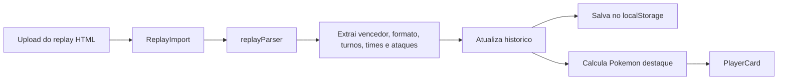
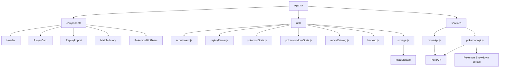

# Placar Pokemon Showdown

Aplicacao web local feita com React + Vite para controlar o placar das partidas diarias de Pokemon Showdown entre Jean Carlos e Felipe Eckert.

## Objetivo

O objetivo do projeto e oferecer um placar visual, responsivo e persistente para registrar vitorias em Single Battles e Double Battles, acompanhar estatisticas, importar replays HTML do Pokemon Showdown e manter um historico detalhado com os times usados em cada partida.

## Motivacao

Este projeto foi criado para acompanhar de forma divertida e visual o placar diario de partidas de Pokemon Showdown entre Jean Carlos e Felipe Eckert, separando vitorias em Single Battles e Double Battles.

## Demonstracao Visual


> Placeholder reservado para um print futuro da tela principal da aplicacao.

Um GIF ou video curto da aplicacao podera ser adicionado futuramente. Veja as instrucoes em [docs/demo-placeholder.md](docs/demo-placeholder.md).

## Tecnologias Usadas

- React
- Vite
- JavaScript
- HTML5
- CSS3
- localStorage
- PokeAPI
- PokeAPI/sprites
- Pokemon Showdown sprites
- GitHub Markdown
- Mermaid diagrams

## Funcionalidades

- Placar total por jogador.
- Pontuacao separada para Single Battles e Double Battles.
- Botoes para adicionar vitorias manualmente.
- Botao para desfazer a ultima vitoria registrada.
- Reset do placar com confirmacao.
- Exportacao e importacao de backup JSON.
- Importacao de replay HTML do Pokemon Showdown.
- Extracao automatica de vencedor, formato, turnos, times e ataques usados.
- Historico em timeline com sprites dos Pokemon usados.
- Tooltip no historico com os ataques usados por cada Pokemon no replay.
- Badges de tipo dos Pokemon no card principal e no historico.
- Consulta de Pokemon com sprite, tipos, abilities, altura, peso e base stats.
- Consulta de detalhes dos moves usados nos replays importados.
- Pokemon destaque calculado por participacao em vitorias.
- Suporte a temporadas.
- Estatisticas gerais e por temporada.
- Persistencia local usando `localStorage`.
- Tema claro e escuro com preferencia salva.
- Layout responsivo em estilo dashboard gamer.

## Fluxo de Importacao de Replay



## Arquitetura



## Calculo das Estatisticas

O total de partidas e a soma das vitorias registradas para Jean Carlos e Felipe Eckert.

O percentual de vitorias de cada jogador e calculado assim:

```text
Win Rate = (vitorias do jogador / total de partidas) * 100
```

Quando nao existe nenhuma partida registrada, os percentuais ficam em `0%` para evitar divisao por zero.

O Pokemon destaque e calculado a partir do historico importado por replay: para cada vitoria, todos os Pokemon do time vencedor recebem +1 participacao em vitoria. O Pokemon com mais participacoes aparece no card principal do jogador.

## Banco de Ataques por Pokemon

Durante a importacao do replay HTML, o app tambem le as linhas `move` do log do Pokemon Showdown.

Exemplo:

```text
|move|p1a: Regieleki|Protect|p1a: Regieleki
```

Com isso, os ataques usados por cada Pokemon ficam salvos dentro do proprio item do historico em `replay.movesByPokemon`.

No historico da batalha, ao passar o mouse ou focar com o teclado em um Pokemon do time, a interface mostra um pop-up com os ataques usados por ele naquele replay. Historicos antigos sem `movesByPokemon` continuam funcionando e exibem a mensagem de que nenhum ataque foi registrado.

O banco agregado de ataques e derivado do historico com `pokemonMoveStats.js`, sem criar um estado paralelo obrigatorio. Assim, backups JSON preservam os ataques automaticamente, porque exportam o historico inteiro.

## Consulta de Pokemon

O card `Consulta de Pokemon` aparece entre `Estatisticas` e `Consulta de Moves`.

Ele pode listar todos os Pokemon do banco local gerado ou apenas os Pokemon encontrados nos times dos replays importados. O modo padrao e `Mostrar todos`.

O card mostra sprite, numero da Pokedex, tipos, altura, peso, abilities, base experience, total de base stats e barras para HP, Attack, Defense, Special Attack, Special Defense e Speed.

O historico continua sendo usado para mostrar o contador `Uso nos historicos`. Se o Pokemon nunca apareceu em replay, o uso aparece como `0 vez`.

Se o banco local estiver vazio, o app usa os Pokemon do historico como fallback. Se a PokeAPI falhar, o app continua funcionando com dados basicos e indica a fonte usada.

## Banco Local de Pokemon

O projeto pode gerar um banco local com detalhes dos Pokemon da PokeAPI:

```bash
npm run data:pokemon
```

O arquivo gerado fica em:

```text
src/data/pokemonDetails.generated.json
```

Durante o uso do app, a consulta de Pokemon segue esta ordem:

1. banco local gerado;
2. fallbacks locais de sprite/tipos;
3. PokeAPI online;
4. dados basicos universais.

Em ambiente corporativo pode ocorrer `SELF_SIGNED_CERT_IN_CHAIN`. Nesse caso, gere o banco fora da rede corporativa ou configure `NODE_EXTRA_CA_CERTS` para o Node. Evite usar `NODE_TLS_REJECT_UNAUTHORIZED=0` como solucao permanente.

## Gerar Banco Local sem PokeAPI

Em redes corporativas, a PokeAPI pode falhar com `SELF_SIGNED_CERT_IN_CHAIN` ou retornar `HTTP 401` por bloqueio/proxy.

Como alternativa offline, o projeto tambem pode gerar os bancos locais usando o Dex do pacote `pokemon-showdown`, sem chamadas HTTPS para a PokeAPI:

```bash
npm run data:showdown
```

Esse comando gera:

```text
src/data/moveDetails.generated.json
src/data/pokemonDetails.generated.json
```

Depois valide os arquivos e o build:

```bash
npm run check:move-data
npm run check:pokemon-data
npm run build
```

O app continua consultando primeiro os arquivos gerados locais. Se eles estiverem vazios ou incompletos, os servicos ainda usam fallbacks e API online quando possivel.

O banco local gerado pelo Pokemon Showdown Dex inclui candidatos de sprites e descricoes de moves quando disponiveis.

As sprites usam URLs publicas do Pokemon Showdown. Se a primeira URL falhar, o app tenta a proxima candidata ate cair no fallback visual local.

Na `Consulta de Pokemon`, as sprites usam fallback em cadeia: banco local gerado, Pokemon Showdown, GitHub da PokeAPI e fallback visual. Isso evita depender de uma unica URL para formas especiais.

Os moves usam descricao em cadeia: `description`, `shortEffect`, `effect`, `flavorText` e, por fim, uma mensagem de fallback quando nenhum texto estiver disponivel.

## Consulta de Moves

O card `Consulta de Moves` fica abaixo da secao de estatisticas.

Ele pode listar todos os moves do banco local gerado ou apenas os moves que apareceram nos replays importados. O modo padrao e `Mostrar todos`.

Ao selecionar um move, o app mostra tipo, categoria, power, accuracy, PP, priority, target, generation, descricao curta, efeito e flavor text.

O card tambem mostra a categoria do move com badge visual: Physical, Special ou Status.

O historico continua sendo usado para mostrar o contador `Uso nos historicos`. Se o move nunca apareceu em replay, o uso aparece como `0 vez`.

Se a PokeAPI falhar ou a rede bloquear a chamada, o app tenta usar o banco local e fallbacks locais. Quando nao houver fallback, ele mostra uma mensagem amigavel.

## Consulta em Banco Completo

Depois de rodar:

```bash
npm run data:showdown
```

os cards `Consulta de Pokemon` e `Consulta de Moves` passam a navegar pelo banco completo gerado pelo Pokemon Showdown Dex.

Cada card possui o filtro:

- `Mostrar todos`
- `Somente usados nos replays`

O banco local fornece os detalhes exibidos. O historico segue como fonte para calcular quantas vezes cada Pokemon ou move apareceu nas batalhas importadas.

## Banco Local de Moves

O projeto pode gerar um banco local com detalhes de todos os moves da PokeAPI:

```bash
npm run data:moves
```

O arquivo gerado fica em:

```text
src/data/moveDetails.generated.json
```

Durante o uso do app, a consulta de moves segue esta ordem:

1. banco local gerado;
2. fallbacks locais manuais;
3. PokeAPI online;
4. dados basicos universais.

Se o banco local estiver vazio, o app continua funcionando com fallbacks e API online. O arquivo gerado pode ser versionado no GitHub para evitar chamadas move por move durante o uso normal.

Em ambiente corporativo com certificado self-signed, o download pode falhar. A solucao recomendada e executar `npm run data:moves` em uma rede sem bloqueio, configurar corretamente o certificado corporativo no Node ou manter o JSON versionado depois de gerado em outra rede. Evite usar `NODE_TLS_REJECT_UNAUTHORIZED=0` como solucao permanente.

## Tipagens dos Pokemon

Os tipos dos Pokemon sao buscados dinamicamente pela PokeAPI usando a mesma normalizacao de nomes usada para sprites.

Eles aparecem:

- no card principal, abaixo do Pokemon destaque;
- nos times do historico, abaixo do nome de cada Pokemon.

Se a PokeAPI estiver indisponivel ou a rede bloquear a chamada, o app continua funcionando normalmente e apenas deixa de exibir os badges de tipo naquele momento.

<details>
<summary><strong>Como Rodar Localmente</strong></summary>

Instale as dependencias:

```bash
npm install
```

Inicie o servidor local:

```bash
npm run dev
```

Abra a URL exibida no terminal. Normalmente:

```text
http://localhost:5173/
```

Se `localhost` nao abrir, tente:

```text
http://127.0.0.1:5173/
```

Gere o build de producao:

```bash
npm run build
```

Os arquivos finais sao gerados na pasta `dist/`.

</details>

<details>
<summary><strong>Como Importar Replay HTML</strong></summary>

O app permite importar um arquivo `.html` de replay exportado do Pokemon Showdown.

O parser procura o bloco:

```html
<script type="text/plain" class="battle-log-data">
```

A partir desse log, o app identifica:

- formato da batalha;
- tipo da batalha: Single ou Double;
- jogadores originais do Showdown;
- vencedor original;
- vencedor mapeado para o placar;
- quantidade de turnos;
- id do replay, quando disponivel;
- times usados por Jean Carlos e Felipe Eckert.
- ataques usados por cada Pokemon durante a batalha.

Depois da leitura, a interface mostra uma previa e pede confirmacao antes de registrar a vitoria.

Mapeamento atual de aliases:

- `demikimi` = Jean Carlos
- `tergoat` = Felipe Eckert
- `tergoak` = Felipe Eckert

O mapeamento fica em `src/data/playerAliases.js`.

</details>

<details>
<summary><strong>Como Exportar e Importar Backup JSON</strong></summary>

O app salva automaticamente placar, historico, temporadas e preferencias no `localStorage` do navegador.

Para criar um backup manual:

1. Clique em `Exportar backup JSON`.
2. Guarde o arquivo gerado.
3. Opcionalmente coloque o arquivo na pasta `data/`.
4. Versione no GitHub com um commit.

Para restaurar:

1. Clique em `Importar backup JSON`.
2. Selecione o arquivo `.json`.
3. Confirme a substituicao dos dados atuais.

O GitHub nao e atualizado automaticamente. O projeto nao usa token do GitHub no frontend por seguranca.

Comandos para versionar um backup:

```bash
git status
git add data/scoreboard-backup.json
git commit -m "data: update scoreboard backup"
git push origin main
```

Um exemplo de estrutura compativel esta em `data/scoreboard.example.json`.

</details>

<details>
<summary><strong>Troubleshooting</strong></summary>

### A aplicacao nao abre

Depois da migracao para React + Vite, o projeto nao deve ser aberto com duplo clique no `index.html`.

Use:

```bash
npm run dev
```

Depois abra:

```text
http://127.0.0.1:5173/
```

### O build falha com `spawn EPERM`

Em alguns ambientes Windows com sandbox ou politica restrita, o `esbuild` pode falhar com `spawn EPERM`.

Quando isso acontece, rode novamente o comando em um terminal normal do Windows:

```bash
npm run build
```

### O replay importa vencedor, mas nao importa jogadores ou times

Abra o DevTools do navegador e procure pelos logs:

- `First 20 battle log lines`
- `Extracted showdown players`
- `Extracted teams`

Tambem e possivel validar o parser com:

```bash
npm run check:replay
npm run check:moves
```

Para validar um replay real pelo terminal:

```bash
node scripts/checkReplayParser.mjs caminho/do/replay.html
```

### Sprites nao aparecem

O app tenta carregar sprites em camadas:

1. PokeAPI/sprites no GitHub.
2. Endpoint JSON da PokeAPI.
3. Pokemon Showdown sprites.
4. Fallback visual local.

Se a rede bloquear fontes externas, o fallback local evita que a interface quebre.

### Pokemon aparece sem sprite ou sem tipagem

Isso normalmente acontece quando entra um Pokemon novo ou uma forma especial ainda nao mapeada, como `Lycanroc-Dusk`, `Toxtricity-Low-Key` ou `Oricorio-Pa'u`.

Para corrigir:

1. adicione o Pokemon em `src/data/pokemonTypeFallbacks.js`;
2. revise `normalizePokemonApiName` em `src/services/pokemonApi.js`;
3. garanta candidatos em `getPokemonShowdownSpriteCandidates`;
4. rode:

```bash
npm run check:sprites
npm run build
```

</details>

<details>
<summary><strong>Comandos Git</strong></summary>

Fluxo comum de commit:

```bash
git status
git add .
git commit -m "mensagem do commit"
git push origin main
```

Quando o push for rejeitado por falta de commits remotos:

```bash
git fetch origin
git rebase origin/main
git push origin main
```

</details>

<details>
<summary><strong>Estrutura do Projeto</strong></summary>

```text
.
|-- package.json
|-- vite.config.js
|-- index.html
|-- README.md
|-- TODO.md
|-- LESSONS.md
|-- docs/
|   |-- demo-placeholder.md
|   `-- screenshot-placeholder.svg
|-- data/
|   `-- scoreboard.example.json
`-- src/
    |-- main.jsx
    |-- App.jsx
    |-- styles.css
    |-- data/
    |   |-- moveDetails.generated.json
    |   |-- moveFallbacks.js
    |   |-- playerAliases.js
    |   |-- pokemonDetails.generated.json
    |   `-- players.js
    |-- components/
    |   |-- BackupControls.jsx
    |   |-- Header.jsx
    |   |-- MatchHistory.jsx
    |   |-- MoveInfoCard.jsx
    |   |-- PlayerCard.jsx
    |   |-- PokemonInfoCard.jsx
    |   |-- PokemonMoveTooltip.jsx
    |   |-- PokemonMiniTeam.jsx
    |   |-- PokemonTypeBadges.jsx
    |   |-- ReplayImport.jsx
    |   |-- ScoreControls.jsx
    |   |-- SeasonControls.jsx
    |   `-- StatsPanel.jsx
    |-- services/
    |   |-- moveApi.js
    |   |-- pokemonDetailsApi.js
    |   `-- pokemonApi.js
    `-- utils/
        |-- backup.js
        |-- moveCatalog.js
        |-- pokemonCatalog.js
        |-- pokemonMoveStats.js
        |-- pokemonStats.js
        |-- replayParser.js
        |-- storage.js
        `-- scoreboard.js
```

</details>

<details>
<summary><strong>Roadmap</strong></summary>

As proximas melhorias estao organizadas em [TODO.md](TODO.md).

Algumas ideias principais:

- importar replay por URL;
- editar aliases pela interface;
- exportar historico em CSV;
- criar ranking global de Pokemon mais vencedores;
- gravar GIF real de demonstracao;
- publicar com GitHub Pages.

</details>

## Como Publicar Futuramente com GitHub Pages

1. Gere o build com `npm run build`.
2. Configure o repositorio no GitHub.
3. Acesse `Settings` no repositorio.
4. Entre em `Pages`.
5. Escolha a branch e a origem de publicacao desejada.
6. Publique a pasta gerada pelo Vite, ou configure uma GitHub Action para publicar `dist/`.

## Links

- [Pokemon Showdown](https://pokemonshowdown.com/)
- [PokeAPI](https://pokeapi.co/)
- [PokeAPI/sprites](https://github.com/PokeAPI/sprites)
